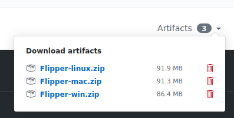

# Contributing to Flipper

We want to make contributing to this project as easy and transparent as
possible.

## Our Development Process

Changes from Facebook employees are synced to the GitHub repo automatically.
PRs from the community are imported into our internal source control and then
pushed to GitHub.

For changes affecting both, native code and JavaScript, make sure to only create
a single PR containing both parts of the code.

Although the Flipper desktop app is only released for macOS right now, it is
possible to create Windows and Linux builds of the app. Please keep this in mind
when dealing with platform-specific code.

## Pull Requests

We actively welcome your pull requests.

1. Fork the repo and create your branch from `master`.
2. If you've added code that should be tested, add tests.
3. If you've changed APIs, update the documentation.
4. Ensure the test suite passes.
5. Make sure your code lints.
6. If you haven't already, complete the Contributor License Agreement ("CLA").

### Verifying changes to Flipper

After opening a pull request or pushing to a branch, the CI will generate
build artifacts for you for Linux, MacOS and Windows. You can download them
from the GitHub Actions checks on your Pull Request.

## Contributor License Agreement ("CLA")

In order to accept your pull request, we need you to submit a CLA. You only need
to do this once to work on any of Facebook's open source projects.

Complete your CLA here: <https://code.facebook.com/cla>

## Issues

We use GitHub issues to track public bugs. Please ensure your description is
clear and has sufficient instructions to be able to reproduce the issue.

Facebook has a [bounty program](https://www.facebook.com/whitehat/) for the safe
disclosure of security bugs. In those cases, please go through the process
outlined on that page and do not file a public issue.

## Coding Style

We are using Prettier to format our source code. The styles are enforced via
eslint. Make sure everything is well formatted before creating a PR. Therefore,
run `yarn lint` and `yarn fix` to apply formatting fixes.

## License

By contributing to Flipper, you agree that your contributions will be licensed
under the [LICENSE](./LICENSE) file.
