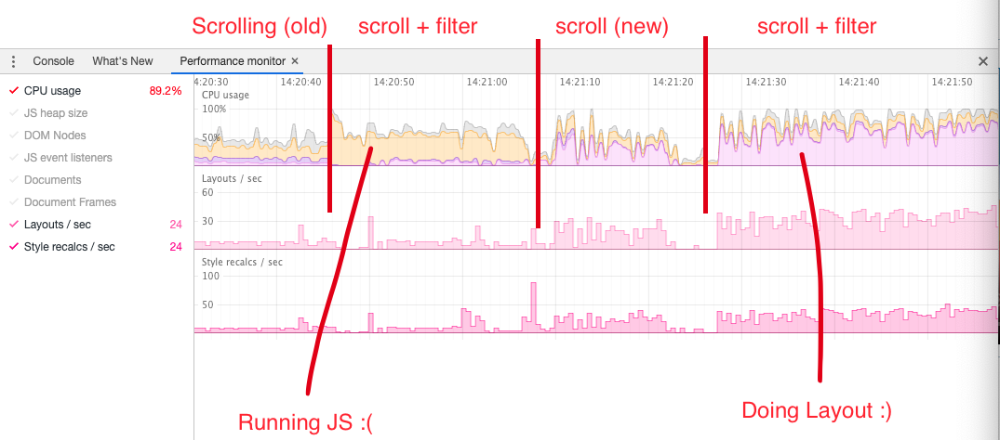
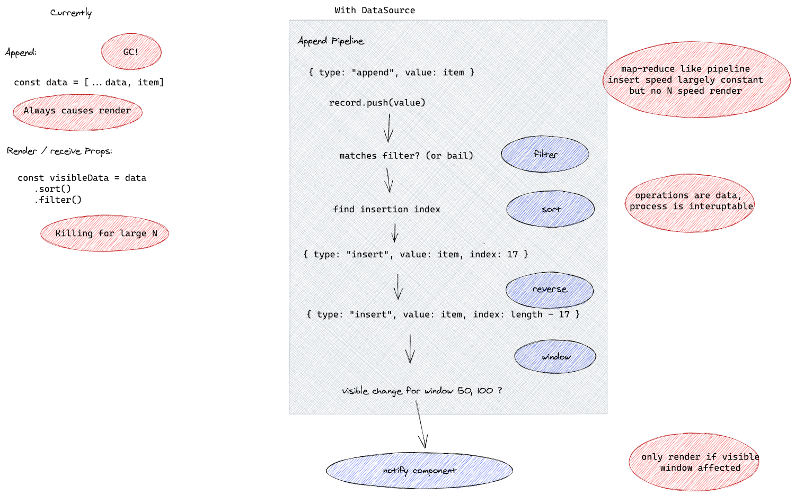

# DataSource

_Library to power streamig data visualisations_

## Contstraints & Benefits

This library builds a map-reduce inspired data processing pipeline that stores data, and can incrementally update existing visualizations when new data arrives or existing data is updated. It achieves this by emitting events that describe how a visualisation should be _changed_ over time, rather than computing & providing a fresh immutable dataset when the stored data is updated. Some benefits:

* Appending or updating records is roughly `O(update_size)` instead of `O(dataset_size)`, while still respecting filtering, sorting and windowing
* Virtualization (windowing) is built in.
* Dynamic row wrapping is supported when rendering tables.
* Any stable JS function can be used for sorting and filtering, without impacting performance significantly.

This library is designed with the following constraints in mind:

* The full dataset is kept in memory (automatically removing old items is supported to prevent unlimited growth)
* New data or data updates arrive 'streaming' over time. For rendering a large fixed dataset that doesn't evolve over time this abstraction offers no benefits.

After applying this abstraction (right two sections), in Flipper we saw a 10-20 fold framerate increase while displaying 100K log items, to which new records where added at a rate of ~50/sec. The above image is taken while tailing the logs (so it continuesly scrolls with the arrival of new data), while a search filter is also active. In the first two sections, scripting ate away most of the CPU, result in just a couple of frames per second. After applying these changes CPU time is primarily spend on cranking out more frames resulting in a smooth rather than stuttering scroll (see the lightning talk below for a demo). On top of that the base situation uses a fixed row-height, while the new situation supports text wrapping.

## Links

* [DataSource API documentation](https://fbflipper.com/docs/extending/flipper-plugin#createdatasource)
* [DataSource project plan](https://fb.quip.com/noJDArpLF7Fe)
* Introduction talk (TODO)
* [Lightning talk using DataSource in Logs view](https://fb.workplace.com/groups/427492358561913/permalink/432720091372473/)

## More detailed explanation

### DataSource

Many visualization and underlying storage abstractions are optimised for large but fixed datasets.
This abstractions is optimised for visualization that need to present datasets that are continuesly updated / expanded.

The significant difference to many other solutions is that DataSource doesn't produce an immutable dataset that is swapped out every time the data is changed.
Instead, it keeps internally a mutable dataset (the records stored themselves are still immutable but can be replaced) to which new entries are added.
However, instead of propagating the dataset to the rendering layer, events are emitted instead.

### DataSourceView

Conceptually, `DataSourceView` is a materialized view of a `DataSource`.
For visualizations, typically the following transformations need to be applied: filter/search, sorting and windowing.

Where many libraries applies these transformations as part of the _rendering_, DataSourceView applies these operations directly when updates to the dataset are received.
As a result the transformations need to be applied only to the newly arriving data.
For example, if a new record arrives for a sorted dataset, we will apply a binary inseration sort for the new entry, avoiding the need for a full re-sort of the dataset during Rendering.

Once the dataset is updated, the DataSource will emit _events_ to the `DataSourceRenderer`, rather than providing it a new dataset.
The events will describe how the current view should be updated to reflect the data changes.

### DataSourceRendererVirtual

`DataSourceRendererVirtual` is one of the possible visualizations of a DataSourceView.
It takes care of subscribing to the events emitted by the `DataSourceView`, and applies them when they are relevant (e.g. within the visible window).
Beyond that, it manages virtualizations (using the `react-virtual` library), so that for example scroll interactions are used to move the window of the`DataSourceView`.

Typically this component is used as underlying abstraction for a Table representation. 

### DataSourceRendererStatic

A simplified (and not very efficient) render for DataSource that doens't use virtualization. Use this as basic for a natural growing representaiton.

### DataSourceChartRenderer

## Future work

* [ ] **Give this thing a proper name**
* [ ] **Leverage React concurrent mode**: Currently there is custom scheduler logic to handle high- and low- (outside window) priority updates. In principle this could probably be achieved through React concurrent mode as well, but ANT.design (which is used in Flipper) doesn't support it yet.
* [ ] **Support multiple DataSourceView's per DataSource**: Currently there is a one view per source limitation because we didn't need more yet.
* [ ] **Break up operations that process the full data set in smaller tasks**: There are several operations that process the full data set, for example changing the sort / filter criteria. Currently this is done synchronously (and we debounce changing the filter), in the future we will split up the filtering in smaller taks to make it efficient. But we don't have a way to efficiently break down sorting into smaller tasks as using insertion sorting is 20x slower than the native sorting mechanism if the full data set needs to be processed.
* [ ] **Publish as open source / standalone package**
* [ ] **Reduce build size**. Currently half lodash is baked in, but basically we only need it's binary sort function :).
