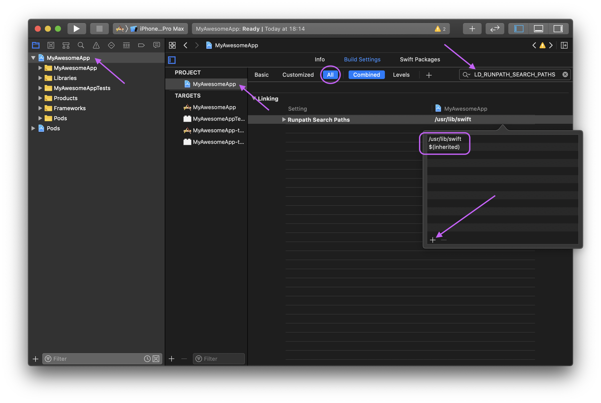
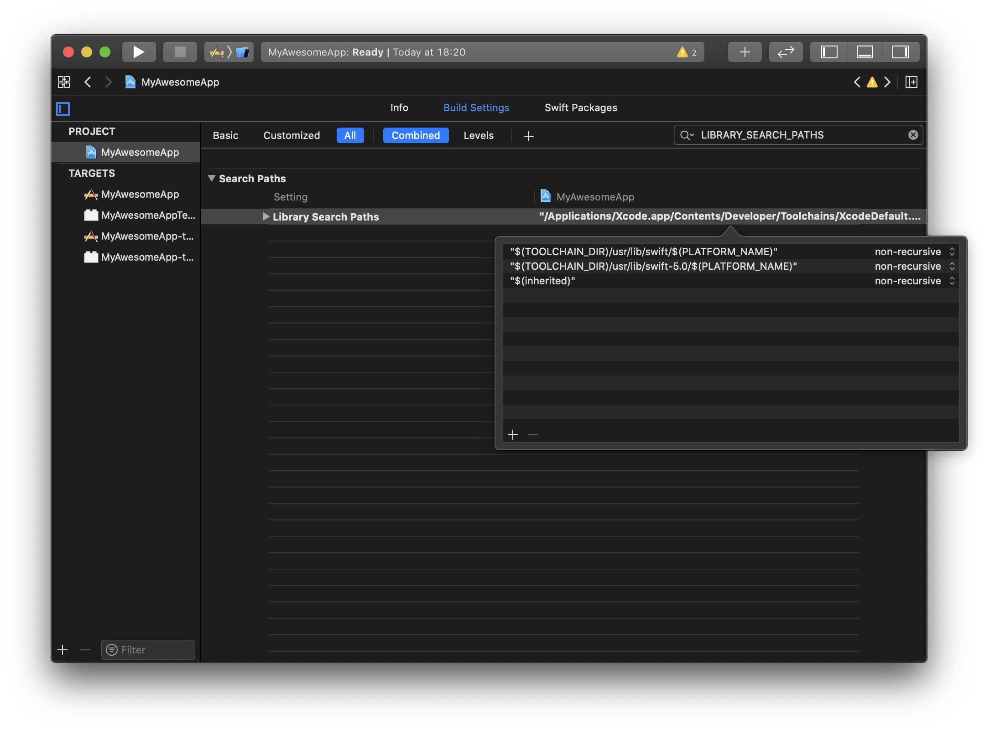

We hope that flipper works well out of the box, but the software is a work in progress and problems will occur. Below are some known issues and steps you can take to try to resolve them.

## Mac Desktop app

### Flipper won't launch on Mac

* If the window is appearing, try opening the Chrome DevTools within Flipper. To do so, from the View menu select Toggle Developer Tools or press CMD+Option+I and check if there are any errors on the console.
* Launch Flipper from the command line using `/Applications/Flipper.app/Contents/MacOS/Flipper`. This should give you some logs, that might be helpful when debugging.
* Delete `~/.flipper` and try relaunching Flipper.
* Delete Flipper from your applications folder and redownload [Flipper](https://www.facebook.com/fbflipper/public/mac).
* If you're using `yarn start` to run from source, make sure all dependencies are installed correctly by running yarn install.

### iOS Simulator missing from devices dropdown

* Check that `xcode-select -p` shows the same XCode version that you're using. If not, see xcode-select for how to select the correct version.

### No plugins showing up for your device

* Check your device isn't on the list of [known incompatibilities](#known-incompatibilities).
* Make sure your version of Flipper is up to date.
* Make sure the mobile SDK you are using is relatively recent (<1 month old).
* Open Chrome dev tools within Flipper. To do so, from the View menu select Toggle Developer Tools or press CMD+Option+I and check if there are any errors on the console.
* Delete `~/.flipper`.
* **Uninstall** and reinstall the mobile app.
* Make sure the time and date are set correctly on your mobile device and desktop computer.
* If no app plugins are showing up, there may be a connectivity issue between Flipper and your app. Check [connection issues](#connection-issues) to see if anything is failing.

### Connection Issues
The Flipper SDK includes an in-app connection diagnostics screen to help you diagnose problems.

#### Android
Replace `<APP_PACKAGE>` below with the package name of your app, e.g. `com.facebook.flipper.sample`.
On a terminal, run the following:
```bash
adb shell am start -n <APP_PACKAGE>/com.facebook.flipper.android.diagnostics.FlipperDiagnosticActivity
```
This will only work if you added `FlipperDiagnosticActivity` to your `AndroidManifest.xml`. See [getting started](getting-started.html) for help.

#### iOS
You'll need to manually add this [ViewController](https://github.com/facebook/flipper/blob/master/iOS/FlipperKit/FlipperDiagnosticsViewController.m) to your app to see the in-app diagnostics.

### Known Incompatibilities
The following devices are known to be incompatible or face issues with flipper:
* Physical iOS devices. Currently on iOS, only simulators are supported ([Tracking Issue](https://github.com/facebook/flipper/issues/262)).
* Some Samsung devices ([Tracking Issue](https://github.com/facebook/flipper/issues/92)).
* Genymotion emulators on Android 8+ are reported to have issues.

### File an Issue
Still not working? File an issue on [GitHub](https://github.com/facebook/flipper/issues) with the chrome DevTools logs and the output from the diagnostics screen, if relevant.

## Android

Build error after including the Flipper dependency:

```
Exception from call site #4 bootstrap method
```

This can happen because we include [OkHttp3](https://github.com/square/okhttp/issues/4597#issuecomment-461204144) as dependency which makes use of Java 8 features. There are two ways of dealing with this:

**Enable Java 8 support**

Add this to your Gradle config:

```groovy
android { 
  compileOptions { 
    targetCompatibility = "8"
    sourceCompatibility = "8"
   }
 }
 ```
 
 **Exclude the OkHttp3 dependency**
 
 Alternatively, if you don't plan on making use of OkHttp, you can exclude the dependency from the build entirely:
 
 ```
debugImplementation('com.facebook.flipper:flipper:*') {
  exclude group: 'com.squareup.okhttp3'
}
```

## iOS

### Build errors in React Native

If you experience errors such as `Undefined symbol: associated type descriptor for FloatLiteralType` or `Undefined symbol: __swift_FORCE_LOAD_$_swiftCompatibility50` after going through the [Getting Started](/docs/getting-started.html) tutorial you must do as follows:

1. Open your project in Xcode;
1. Click in your project's name on the left side;
1. Make sure that you choose your project under `PROJECT` on the screen that has been opened;
1. Go to the tab `Build Settings`;
1. Search for `LD_RUNPATH_SEARCH_PATHS` (make sure that `All` is selected);
1. Double-click `Runpath Search Paths` and, in the dialog that opens, click on the plus button at the bottom-left corner and paste `/usr/lib/swift $(inherited)` there;
   
1. Now search for `LIBRARY_SEARCH_PATHS`;
1. Double-click `Library Search Paths` and, in the dialog that opens, add the following items:

   ```
   "$(TOOLCHAIN_DIR)/usr/lib/swift/$(PLATFORM_NAME)"
   "$(TOOLCHAIN_DIR)/usr/lib/swift-5.0/$(PLATFORM_NAME)"
   "$(inherited)"
   ```

   _Note: all of them should be added as `non-recursive` (the default)._

   In the end it should look like this:
   

1. Now you can run your build normally.
